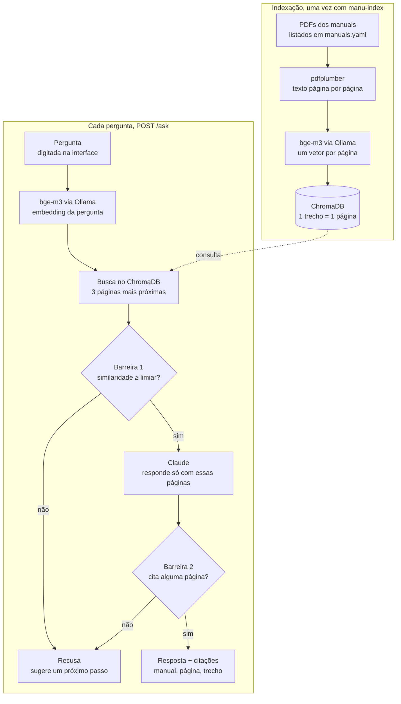

# Manu

Assistente que responde dúvidas sobre eletrodomésticos com base no manual oficial do fabricante, citando a página. Projeto de portfólio construído em fases ([roadmap](docs/roadmap.md)).

## Fase 1: RAG básico

A Fase 1 entrega um pipeline de perguntas e respostas sobre manuais de eletrodomésticos: toda resposta cita o manual e a página de onde veio, e a Manu diz "não sei" em vez de inventar. É a base sobre a qual as próximas sete fases são construídas.

**O problema.** Quando a geladeira ou o micro-ondas dá problema, o dono raramente tem o manual em mãos. Mesmo com o PDF, precisa folhear dezenas de páginas para saber se o comportamento é normal, como resolver ou se a garantia cobre. O resultado é uma visita técnica desnecessária, ou uma garantia que nunca é acionada.

**O que a Fase 1 prova.** A Manu responde perguntas do dia a dia sobre geladeiras e micro-ondas Electrolux e Brastemp usando só os manuais oficiais. A fase também é um objetivo de aprendizado da autora, na migração de frontend para engenharia de IA. Por isso o pipeline é feito de peças soltas, sem framework de RAG como LangChain ou LlamaIndex. A qualidade é medida com um gabarito escrito à mão.

Fora desta fase: identificação do produto pela foto da etiqueta (fases 2 e 3), filtro por modelo, OCR, memória de conversa. Detalhes no [spec](docs/fases/fase-1/spec.md).

### Como funciona

Uma pergunta vira uma resposta citada em quatro passos: embedding, busca, verificação e geração. Duas barreiras decidem quando a Manu recusa.



**A indexação** roda uma vez. Ela lê cada manual, extrai o texto página por página e grava um vetor por página no ChromaDB. Cada trecho guarda marca, modelo, categoria e página, e seu ID é manual + página, então reindexar substitui em vez de duplicar.

**A barreira 1** atua antes de qualquer chamada paga: se nem a melhor página passa do limiar de similaridade, a API recusa sem chamar o Claude. **A barreira 2** é o prompt: o Claude só pode responder com base nas páginas recuperadas, precisa dizer quais usou e sinaliza a recusa num campo estruturado. Uma resposta que não cita nenhuma página recuperada também conta como recusa. Falha no Ollama ou no Claude retorna erro 5xx, nunca uma recusa disfarçada.

### Tecnologias

O projeto é um monorepo com duas partes: a API em Python (`api/`), com o pipeline de RAG, e a interface em Next.js (`web/`). Os embeddings rodam localmente e sem custo; só a geração da resposta chama uma API paga.

| Camada | Tecnologia | Papel na Manu | Por que esta escolha |
| --- | --- | --- | --- |
| Linguagem (API) | Python 3.12 | Todo o pipeline: extração, indexação, busca, geração, avaliação | Linguagem padrão em IA; tipagem estrita com mypy |
| Extração de PDF | pdfplumber | Extrai o texto de cada manual, página por página; páginas em duas colunas são lidas uma coluna por vez | Dá o texto com posições, o que permite tratar colunas |
| Registro de manuais | YAML (PyYAML) | `manuals.yaml` lista marca, códigos de modelo, categoria, link de origem e arquivo local | Legível; permite baixar os mesmos PDFs sem que eles fiquem no repositório |
| Embeddings | Ollama com bge-m3 | Transforma cada página e cada pergunta num vetor | Local e gratuito; o bge-m3 é multilíngue, necessário para manuais e perguntas em português |
| Cliente HTTP | httpx | Chama a API do Ollama | Simples e tipado |
| Banco vetorial | ChromaDB | Guarda um vetor por página com seus metadados; devolve as 3 páginas mais próximas | Roda embutido em disco, sem servidor; recriado por um comando |
| Geração da resposta | Claude, via SDK da Anthropic | Escreve uma resposta curta em português só com as páginas recuperadas e diz quais usou | Segue bem a instrução "responda só com este contexto"; modelo definido por configuração |
| API | FastAPI + Uvicorn | `POST /ask` e `GET /health`; validação da entrada; CORS para a interface | Validação e contratos tipados de graça |
| Interface | Next.js 16, React 19, TypeScript | Campo de pergunta, resposta, cartões de citação, "ver detalhes" com a similaridade | Experiência da autora em frontend |
| Estilo | Tailwind CSS 4 | Sistema visual da interface | Rápido de iterar; depois virou o design system em `DESIGN.md` |
| Testes | pytest + fpdf2 | Testes do `/ask` e da extração; o fpdf2 gera um PDF de teste no código | Nenhum manual de terceiros no repositório, nenhuma rede nos testes |
| Configuração | Variáveis de ambiente (`.env`, `.env.example`) | Modelos, URL do Ollama, top-k, limiar, chave da API, origem do CORS | Trocar modelos ou ajustar a busca sem mexer no código; segredos fora do git |

A API também traz quatro comandos: `manu-extract`, `manu-validate`, `manu-index` e `manu-eval`.

### Testes e avaliação

Na avaliação mais recente, a página certa aparece entre as 3 primeiras em 75% das perguntas com resposta, e 80% das perguntas sem resposta são recusadas corretamente. A qualidade é verificada de dois jeitos: testes automáticos para o comportamento e um gabarito para a qualidade das respostas.

**Testes automáticos (12).** Dez testam o `POST /ask` e dois testam a extração de PDF. Eles usam um embedder falso com vetores escolhidos e um Claude falso que registra se foi chamado. O ChromaDB é real, mas temporário. Rodam sem rede, sem Ollama e sem chave de API. Verificam que similaridade baixa recusa sem chamar o Claude, que a recusa do Claude volta como `refused: true`, que só as páginas usadas são citadas, que entrada inválida retorna 422, que falhas de serviço retornam 5xx (nunca uma recusa falsa) e que reindexar não duplica.

**Gabarito e script de avaliação.** O [`api/eval/gabarito.yaml`](api/eval/gabarito.yaml) tem 25 perguntas do dia a dia: 20 com manual e página esperados e 5 que os manuais não respondem. O `manu-eval` passa cada uma pelo pipeline real e gera um relatório em Markdown.

| Métrica | Resultado (limiar 0,5, top-3, bge-m3) |
| --- | --- |
| Acerto de busca (página esperada no top-3) | 75% (15/20) |
| Recusa correta (sem resposta e recusada) | 80% (4/5) |
| Recusa indevida (com resposta e recusada) | 15% (3/20) |
| Falhas de execução | 0 |

O relatório também lista a melhor similaridade de cada pergunta. As perguntas com resposta começam em 0,549; as sem resposta ficam em 0,489, 0,524, 0,570, 0,581 e 0,601. Os dois grupos se sobrepõem, então nenhum limiar os separa por completo. Um limiar de 0,53 recusa as duas mais baixas sem recusar nenhuma pergunta com resposta; o Claude precisa barrar as outras três.

## Como rodar

### Pré-requisitos

- Python 3.12+
- Node 20+
- [Ollama](https://ollama.com) rodando localmente, com o modelo de embeddings:

```bash
ollama pull bge-m3
```

- Uma chave da API do Claude.

### 1. API

```bash
cd api
python -m venv .venv
.venv/bin/pip install -e ".[dev]"
cp .env.example .env
```

Preencha `ANTHROPIC_API_KEY` no `.env`.

### 2. Manuais

Os PDFs não ficam no repositório ([ADR 0006](docs/adr/0006-manuais-fora-do-repositorio.md)). Baixe cada manual pelo `source_url` listado em [`api/data/manuals.yaml`](api/data/manuals.yaml) e salve em `api/data/pdfs/` com o nome do campo `file`. Depois confira:

```bash
.venv/bin/manu-validate
```

### 3. Indexar

```bash
.venv/bin/manu-index
```

Reindexar substitui os dados anteriores. Se trocar `EMBEDDING_MODEL`, apague `data/chroma/` antes.

### 4. Subir a API

```bash
.venv/bin/uvicorn manu.main:app --port 8000
```

### 5. Subir a interface

```bash
cd web
npm install
cp .env.example .env.local
npm run dev
```

Abra http://localhost:3000.

### Testes

```bash
cd api
.venv/bin/pytest
```

Os testes não usam rede, Ollama nem a chave do Claude.

### Avaliação

Com a base indexada e o gabarito preenchido em [`api/eval/gabarito.yaml`](api/eval/gabarito.yaml):

```bash
cd api
.venv/bin/manu-eval
```

O relatório é salvo em `api/eval/reports/`.

## Decisões

- **Embeddings:** `bge-m3` via Ollama. É multilíngue (manuais e perguntas estão em português), roda local e sem custo por chamada.
- **Geração:** Claude com saída estruturada (`answer`, `refused`, `used_chunk_ids`). A resposta nunca depende de interpretar texto livre.
- **Duas barreiras contra alucinação:** limiar de similaridade antes do LLM e instrução para recusar quando os trechos não bastam.
- **Limiar de similaridade:** _pendente de calibração com o gabarito (valor provisório 0,5)._

## Resultados

_Pendente: preenchido após a calibração do limiar com o gabarito final._

| Métrica | Valor |
|---|---|
| Acerto de busca (top-3) | — |
| Recusa correta | — |
| Recusa indevida | — |
| Respostas julgadas corretas | — |
