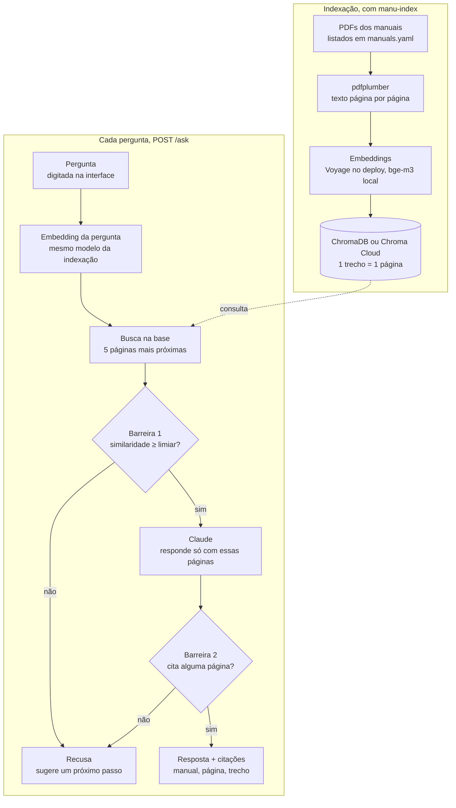

# Manu

Assistente que responde dúvidas sobre eletrodomésticos com base no manual oficial do fabricante, citando a página. Projeto de portfólio construído em fases ([roadmap](docs/roadmap.md)).

## Fase 1: RAG básico

A Fase 1 entrega um pipeline de perguntas e respostas sobre manuais de eletrodomésticos: toda resposta cita o manual e a página de onde veio, e a Manu diz "não sei" em vez de inventar. É a base sobre a qual as próximas fases são construídas.

**O problema.** Quando a geladeira ou o micro-ondas dá problema, o dono raramente tem o manual em mãos. Mesmo com o PDF, precisa folhear dezenas de páginas para saber se o comportamento é normal, como resolver ou se a garantia cobre. O resultado é uma visita técnica desnecessária, ou uma garantia que nunca é acionada.

**O que a Fase 1 prova.** A Manu responde perguntas do dia a dia sobre geladeiras e micro-ondas Electrolux e Brastemp usando só os manuais oficiais. A fase também é um objetivo de aprendizado da autora, na migração de frontend para engenharia de IA. Por isso o pipeline é feito de peças soltas, sem framework de RAG como LangChain ou LlamaIndex. A qualidade é medida com um gabarito escrito à mão.

### O que a Fase 1 entrega

- **Base de manuais:** 17 manuais oficiais (8 de geladeira e 9 de micro-ondas, Electrolux e Brastemp), com 346 páginas indexadas. O [registro](api/data/manuals.yaml) guarda marca, códigos de modelo, categoria, link de origem e arquivo de cada um.
- **Extração de texto por página:** lê páginas em duas colunas, descarta páginas sem texto útil, respeita a área visível do PDF (CropBox) e recorta as folhas de impressão em painéis, numerando cada um pelo número impresso, para a citação bater com o manual.
- **Indexação:** uma página vira um trecho, com identificador `manual + página`, então reindexar substitui em vez de duplicar. Os metadados (marca, modelo, categoria, página) alimentam as citações. Embeddings `bge-m3` (Ollama, local) ou `voyage-3.5` (deploy), e base no ChromaDB em disco ou no Chroma Cloud, escolhidos por variável de ambiente.
- **Busca e recusa:** as 5 páginas mais parecidas com a pergunta, com similaridade. Se a melhor ficar abaixo do limiar (0,5), a Manu recusa sem chamar o Claude.
- **Resposta:** o Claude responde só com os trechos recuperados, em português e em saída estruturada, e a citação traz só as páginas que ele usou. Se a pergunta não diz o modelo e os manuais divergem, ele responde por modelo; se os trechos não bastam, recusa.
- **API (FastAPI):** `POST /ask` devolve resposta, se foi recusa e as citações (marca, modelo, página, trecho, similaridade). Pergunta vazia ou com mais de 1000 caracteres retorna 422. Falha do embedder ou do Claude retorna erro 5xx, nunca uma recusa disfarçada. `GET /health` confere se está no ar.
- **Interface (Next.js):** o chat é a página inicial, com exemplos de pergunta. Cada resposta mostra as fontes (trecho destacado, manual, página e similaridade). Resposta, recusa e erro aparecem de formas distintas. A interface fala com a API pelo servidor, então o navegador não vê o endereço dela.
- **Avaliação:** um gabarito de 35 perguntas (30 com resposta e 5 sem), em que cada item traz uma evidência conferida automaticamente com o texto dos PDFs (`manu-eval --check`). O `manu-eval` roda tudo pelo pipeline real e gera um relatório com as métricas, a distribuição das similaridades e o espaço para julgar cada resposta.
- **Testes:** 21 testes automáticos, sem rede, sem Ollama e sem chave do Claude, com fixtures próprias.
- **Deploy:** API e interface em dois projetos na Vercel, com embeddings da Voyage e base no Chroma Cloud. Veja [Deploy](#deploy-vercel).

Fora desta fase: identificação do produto pela foto da etiqueta (fases 2 e 3), filtro por modelo, OCR, memória de conversa.

### Como funciona

Uma pergunta vira uma resposta citada em quatro passos: embedding, busca, verificação e geração. Duas barreiras decidem quando a Manu recusa.



**A indexação** roda uma vez. Ela lê cada manual, extrai o texto página por página e grava um vetor por página na base. Cada trecho guarda marca, modelo, categoria e página, e seu ID é manual + página, então reindexar substitui em vez de duplicar.

**A barreira 1** atua antes de qualquer chamada paga: se nem a melhor página passa do limiar de similaridade (0,5), a API recusa sem chamar o Claude. **A barreira 2** é o prompt: o Claude só pode responder com base nas páginas recuperadas, precisa dizer quais usou e sinaliza a recusa num campo estruturado. Uma resposta que não cita nenhuma página recuperada também conta como recusa. Falha no serviço de embeddings ou no Claude retorna erro 5xx, nunca uma recusa disfarçada.

### Tecnologias

O projeto é um monorepo com duas partes: a API em Python (`api/`), com o pipeline de RAG, e a interface em Next.js (`web/`).

| Camada | Tecnologia | Papel na Manu | Por que esta escolha |
| --- | --- | --- | --- |
| Linguagem (API) | Python 3.12+ | Todo o pipeline: extração, indexação, busca, geração, avaliação | Linguagem padrão em IA; tipagem estrita com mypy |
| Extração de PDF | pdfplumber | Extrai o texto de cada manual, página por página; lê páginas em duas colunas uma coluna por vez, respeita a área visível do PDF e recorta folhas de impressão em painéis | Dá o texto com posições, o que permite tratar colunas e recortes |
| Registro de manuais | YAML (PyYAML) | `manuals.yaml` lista marca, códigos de modelo, categoria, link de origem, arquivo e, quando preciso, a grade de recorte | Legível; documenta a origem de cada PDF |
| Embeddings | Voyage AI (`voyage-3.5`) no deploy; Ollama com `bge-m3` local | Transforma cada página e cada pergunta num vetor | Os dois são multilíngues, necessário para manuais e perguntas em português; a Vercel não roda o Ollama ([ADR 0008](docs/adr/0008-embeddings-e-base-hospedados-no-deploy.md)) |
| Cliente HTTP | httpx | Chama os serviços de embeddings | Simples e tipado |
| Banco vetorial | ChromaDB em disco, ou Chroma Cloud no deploy | Guarda um vetor por página com seus metadados e devolve as 5 mais próximas | Embutido e sem servidor no desenvolvimento; hospedado em produção |
| Geração da resposta | Claude, via SDK da Anthropic | Escreve uma resposta curta em português só com as páginas recuperadas e diz quais usou, em saída estruturada | Segue bem a instrução "responda só com este contexto"; modelo definido por configuração |
| API | FastAPI + Uvicorn | `POST /ask` e `GET /health`; validação da entrada; CORS para a interface | Validação e contratos tipados de graça |
| Interface | Next.js 16, React 19, TypeScript | Chat com a resposta e as fontes (trecho destacado, manual, página e similaridade); fala com a API pelo servidor | Experiência da autora em frontend |
| Estilo | Tailwind CSS 4 | Sistema visual da interface, descrito em `DESIGN.md` | Rápido de iterar |
| Testes | pytest + fpdf2 | Testes do `/ask`, da extração, dos embeddings e da avaliação; o fpdf2 gera os PDFs de teste no código | Nenhum manual de terceiros nos testes e nenhuma rede |
| Deploy | Vercel (dois projetos) | Publica a API e a interface a cada push no `main` | Ver [Deploy](#deploy-vercel) |
| Configuração | Variáveis de ambiente (`.env`, `.env.example`) | Modelos, chaves, top-k, limiar, origem do CORS | Trocar modelos ou ajustar a busca sem mexer no código; segredos fora do git |

A API também traz quatro comandos: `manu-extract`, `manu-validate`, `manu-index` e `manu-eval`.

## Fase 2: identificação do aparelho

A Fase 2 faz a Manu responder só com o manual do aparelho da pessoa. Quem cita o modelo na pergunta ("minha DB44 está quente") vê o aparelho no chip e recebe a resposta só do manual dele; quem não cita pergunta como na Fase 1.

- **Detecção no texto:** a API acha os códigos do registro dentro da pergunta (sem caixa, espaço nem hífen) e aceita o começo do código ("DB44SX" acha "DB44S"). Dois aparelhos na pergunta abrem a escolha entre eles.
- **Busca restrita ao manual:** o filtro por manual vem do registro; a busca usa a pergunta sem o código, que só atrapalhava o vetor.
- **Modelo sem manual:** o chat avisa que não reconheceu o modelo e a API anota o código (sem dado pessoal) para a base crescer. `manu-missing` lista os mais citados.
- **Conversa:** "Nova conversa" limpa as mensagens e o aparelho; o logo volta à tela inicial.

Rodada de 08/10/2026 com `manu-eval --product` (35 perguntas, `voyage-3.5`, limiar 0,5):

| Métrica | Sem produto (Fase 1) | Com produto, código na busca | Com produto, código fora da busca |
|---|---|---|---|
| Acerto de busca | 93% (28/30) | 100% (30/30) | 100% (30/30) |
| Recusa correta | 100% (5/5) | 80% (4/5) | 80% (4/5) |
| Recusa indevida | 7% (2/30) | 3% (1/30) | 0% (0/30) |

A recusa correta cai porque, com o micro-ondas escolhido, a pergunta sobre controle por celular (q25) passa a ser respondida com o aviso do manual de que o aparelho não é para controle remoto: uma resposta fundamentada, não inventada. Por isso a q25 foi reclassificada no gabarito como "com resposta" (sete manuais trazem a frase). A tabela foi medida antes dessa mudança, e repetir `manu-eval --product` com o gabarito novo está pendente. O limiar continua em 0,5: as similaridades das perguntas com e sem resposta se misturam. As decisões estão em [`docs/specs/`](docs/specs/) e o escopo em [`docs/scope/scope.md`](docs/scope/scope.md).

## Como rodar

### Pré-requisitos

- Python 3.12+
- Node 20+
- Para embeddings locais, o [Ollama](https://ollama.com) rodando, com o modelo (dispensável se você usar a Voyage, como no deploy):

```bash
ollama pull bge-m3
```

- Uma chave da API do Claude.

### 1. API

```bash
cd api
python -m venv .venv
.venv/bin/pip install -e ".[local,dev]"
cp .env.example .env
```

Preencha `ANTHROPIC_API_KEY` no `.env`.

### 2. Manuais

Os PDFs dos 17 manuais vêm junto com o repositório, em `api/data/pdfs/` ([ADR 0006](docs/adr/0006-manuais-versionados-no-repositorio.md)). Eles pertencem aos fabricantes; o [`api/data/manuals.yaml`](api/data/manuals.yaml) guarda o `source_url` de cada um, para baixar de novo ou conferir a origem. Alguns PDFs são folhas de impressão, com vários painéis por folha: o campo `grid` do registro diz como recortar, e a página citada é o número impresso no painel. Confira o registro:

```bash
.venv/bin/manu-validate
```

### 3. Indexar

```bash
.venv/bin/manu-index
```

Reindexar substitui os dados anteriores. Se trocar `EMBEDDING_MODEL`, apague `data/chroma/` antes.

### 4. Subir a API

```bash
.venv/bin/uvicorn manu.main:app --port 8000
```

### 5. Subir a interface

```bash
cd web
npm install
cp .env.example .env.local
npm run dev
```

Abra http://localhost:3000.

## Deploy (Vercel)

Interface e API viram dois projetos na Vercel, ligados ao mesmo repositório. O Ollama não roda na Vercel e a base vetorial não vai para o git, só os PDFs ([ADR 0006](docs/adr/0006-manuais-versionados-no-repositorio.md)). Por isso, em produção, os embeddings vêm da [Voyage AI](https://www.voyageai.com) e a base fica no [Chroma Cloud](https://www.trychroma.com).

### 1. Indexar na nuvem (uma vez, da sua máquina)

Crie uma database no Chroma Cloud e uma chave na Voyage. Em `api/.env`, preencha:

```
EMBEDDING_PROVIDER=voyage
EMBEDDING_MODEL=
VOYAGE_API_KEY=...
CHROMA_API_KEY=...
CHROMA_TENANT=...
CHROMA_DATABASE=...
```

Rode `.venv/bin/manu-index`. Para voltar ao modo local, apague essas linhas (ou volte `EMBEDDING_PROVIDER=ollama` e esvazie `CHROMA_API_KEY`).

Os limiares de similaridade mudam de um modelo de embeddings para outro: recalibre `SIMILARITY_THRESHOLD` com `manu-eval` usando essa mesma configuração.

### 2. Projeto da API

Na Vercel: **Add New → Project**, importe o repositório e defina **Root Directory = `api`**. A Vercel detecta o FastAPI e usa `manu.main:app` (`[tool.vercel]` no `pyproject.toml`). Variáveis de ambiente:

`EMBEDDING_PROVIDER=voyage`, `VOYAGE_API_KEY`, `CHROMA_API_KEY`, `CHROMA_TENANT`, `CHROMA_DATABASE`, `ANTHROPIC_API_KEY`, `CLAUDE_MODEL`, `SIMILARITY_THRESHOLD` e `CORS_ORIGIN` (URL da interface; preencha depois do passo 3).

Confira em `https://<api>.vercel.app/health`.

### 3. Projeto da interface

Importe o mesmo repositório de novo, agora com **Root Directory = `web`**. Variável: `NEXT_PUBLIC_API_URL=https://<api>.vercel.app`. Depois do deploy, coloque a URL da interface em `CORS_ORIGIN` no projeto da API e faça um redeploy.

A cada push no `main`, os dois projetos são publicados de novo.

### Testes

```bash
cd api && .venv/bin/pytest   # API
cd web && npm test           # interface (Vitest)
```

Os testes não usam rede, Ollama nem a chave do Claude.

### Avaliação

Com a base indexada e o gabarito preenchido em [`api/eval/gabarito.yaml`](api/eval/gabarito.yaml):

```bash
cd api
.venv/bin/manu-eval
```

O relatório é salvo em `api/eval/reports/`.

## Decisões

- **Embeddings:** dois modelos multilíngues (manuais e perguntas estão em português). O `bge-m3` via Ollama roda local e sem custo por chamada. O deploy usa o `voyage-3.5`, porque a Vercel não roda o Ollama ([ADR 0008](docs/adr/0008-embeddings-e-base-hospedados-no-deploy.md)). A avaliação abaixo usa a configuração do deploy. Uma rodada anterior com o `bge-m3` (25 perguntas, top-3, 9 manuais) deu 75% de acerto de busca, mas não é comparável com a atual: o gabarito e o top-k mudaram. O limiar vale para um modelo só, então trocar de modelo exige recalibrar.
- **Geração:** Claude com saída estruturada (`answer`, `refused`, `used_chunk_ids`). A resposta nunca depende de interpretar texto livre.
- **Duas barreiras contra alucinação:** limiar de similaridade antes do LLM e instrução para recusar quando os trechos não bastam.
- **top-k = 5:** com 3, o acerto de busca cai de 93% para 83% na mesma rodada.
- **Perguntas sem o modelo:** os manuais de modelos diferentes trazem procedimentos diferentes (relógio, potência, espaço de instalação). Em vez de recusar, o Claude responde por modelo. Foi o que corrigiu a recusa indevida do relógio; a solução de verdade é a Fase 2, que identifica o modelo antes de buscar.
- **Limiar de similaridade = 0,5:** confirmado depois da avaliação de 07/10/2026 (veja [Resultados](#resultados)). Subir o limiar recusa mais perguntas com resposta sem pegar muito mais perguntas sem resposta.

## Resultados

Rodada de 07/10/2026: 35 perguntas (30 com resposta nos manuais e 5 sem), 17 manuais, `voyage-3.5`, `claude-sonnet-5`, top-k 5, limiar 0,5. O relatório com cada resposta fica em `api/eval/reports/` (fora do git).

| Métrica | Valor | O que mede |
|---|---|---|
| Acerto de busca (top-5) | 93% (28/30) | a página esperada está entre as 5 recuperadas |
| Recusa correta | 100% (5/5) | perguntas sem resposta que foram recusadas |
| Recusa indevida | 7% (2/30) | perguntas com resposta que foram recusadas |
| Respostas julgadas corretas | _pendente_ | julgamento manual das 35 respostas |

Esses números vêm depois de uma primeira rodada pior (acerto de busca 83%, recusa correta 80%, recusa indevida 14%, 34 perguntas). Três coisas mudaram entre as duas: o gabarito ficou mais justo (perguntas que os manuais respondem em mais de uma página passaram a aceitar todas; uma pergunta que tinha resposta parcial, a do gasto de energia, virou pergunta com resposta e entrou outra sem resposta no lugar), o prompt passou a pedir resposta por modelo, e o Claude varia um pouco de uma execução para outra. Parte da melhora, portanto, vem de um teste mais justo, e não de um sistema melhor.

### Por que o limiar é 0,5

A melhor similaridade das perguntas com resposta vai de 0,52 a 0,79; a das sem resposta, de 0,44 a 0,63. As faixas se sobrepõem, então nenhum valor separa os dois grupos. Simulando só o limiar, sem o Claude:

| Limiar | Sem resposta recusadas | Com resposta recusadas |
|---|---|---|
| 0,5 | 20% (1/5) | 0% (0/30) |
| 0,6 | 40% (2/5) | 13% (4/30) |
| 0,7 | 100% (5/5) | 73% (22/30) |

Em 0,6 o limiar recusa 4 perguntas com resposta para pegar apenas uma pergunta sem resposta a mais; em 0,7 pega todas, mas recusa quase três quartos das perguntas que os manuais respondem. Por isso o limiar fica baixo e a recusa depende sobretudo da segunda barreira: das 5 perguntas sem resposta, 4 foram recusadas pelo Claude e só 1 pelo limiar.

### O que ainda falha

- **Duas falhas de busca (q01, q06), as únicas recusas indevidas:** a página que responde ficou fora das 5 recuperadas. Na q01, três páginas quase idênticas dos manuais Brastemp ocuparam o topo.
- **Variação entre execuções:** a q32 (espaço em volta do micro-ondas) foi recusada na primeira rodada e respondida nas seguintes, com as mesmas páginas. O resultado do Claude não é determinístico, então os percentuais têm uma margem de alguns pontos.
- **Recusa correta com produto selecionado (80%, 4 de 5):** é a q25, que o manual responde de fato (ver Fase 2); ela foi reclassificada no gabarito. A tabela foi medida antes disso, e repetir `manu-eval --product` está pendente. O limiar volta a ser calibrado na Fase 5.
- **Perguntas ambíguas:** sem o modelo, a resposta correta muda de manual para manual. O Claude agora responde por modelo, mas o ideal é perguntar o modelo (Fase 2).

### Próximos passos

- **Fase 3:** identificar o produto pela foto da etiqueta. A Fase 2 já faz isso pelo código citado na pergunta, com a busca só no manual do aparelho (100% de acerto de busca contra 93%).
- **Fase 6:** trechos menores que uma página, busca por palavra-chave junto com os embeddings (termos como "LOC" escapam da busca por significado) e reranking.
- **Avaliação:** gabarito maior e julgamento das respostas com ajuda de um LLM.
